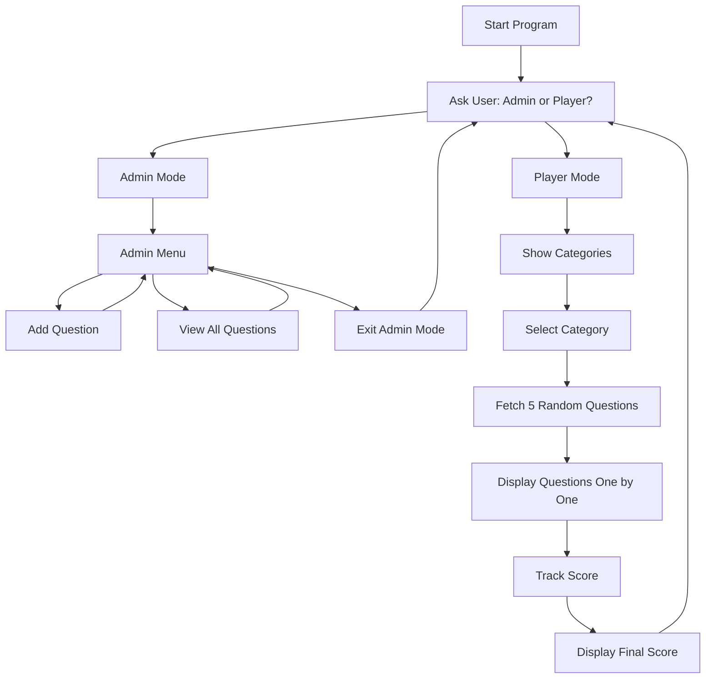

# Quiz System Program Design

## Program Structure Overview

The quiz system will have two main modes:
1. Admin Mode - For managing questions
2. Player Mode - For taking quizzes

## Main Program Flow

## Required Modules

1. `main.py` - Main program entry point
2. `database.py` - Database connection and operations
3. `admin.py` - Admin mode functionality
4. `player.py` - Player mode functionality
5. `utils.py` - Utility functions for input validation and formatting

## Database Module (database.py)

This module will handle all database operations:
- Connection to MySQL database
- Functions to add questions
- Functions to retrieve questions
- Functions to get categories

## Admin Module (admin.py)

This module will handle admin functionality:
- Adding new questions
- Viewing all questions
- Input validation for admin operations

## Player Module (player.py)

This module will handle player functionality:
- Displaying categories
- Selecting a category
- Fetching random questions
- Presenting questions and options
- Tracking score
- Displaying results

## Main Program (main.py)

This will be the entry point that:
- Asks user for mode selection
- Routes to appropriate module based on selection
- Handles program loop and exit